# 🛍️ Retail Sales Data Pipeline

## Overview
This project analyzes historical weekly sales data in the retail domain, applying modern data engineering practices to build a cloud-native analytics pipeline. Raw data is ingested from AWS S3 into Snowflake, transformed using dbt into dimensional models (including an SCD2 fact table), and visualized through interactive dashboards in Python and Plotly.

This project demonstrates a modern data engineering workflow using:

- **AWS S3** for storage of raw CSV data
- **Snowflake** for cloud warehousing
- **dbt** for transformation into dimensional models (SCD2 fact + store/date dimensions)
- **Python + Plotly** for interactive reporting and visualization

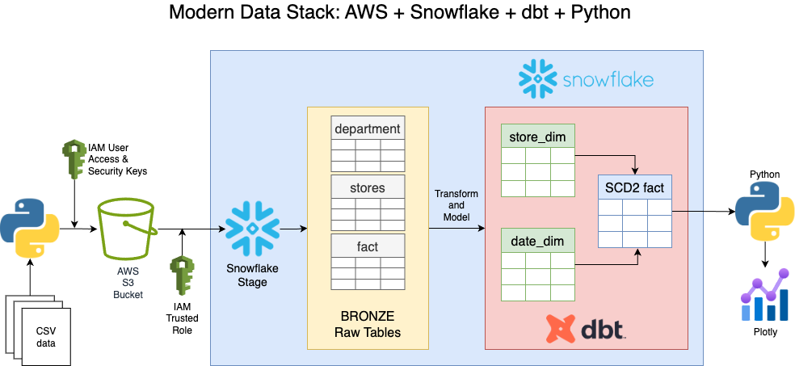

## 📊 Report Overviews

| Report | Summary | Preview |
|--------|---------|---------|
| **Report 1: Weekly Sales by Store and Holiday** | Compares weekly sales for holiday vs. non-holiday periods across all stores. Identifies peak sales weeks and seasonal spikes. | [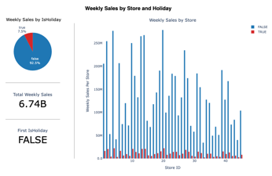](reports/Report_1_Weekly_Sales_by_Store_and_Holiday.png) |
| **Report 2: Weekly Sales by Temperature and Year** | Analyzes how weekly sales relate to outdoor temperatures across different years. Helps visualize weather-related trends in consumer behavior. | [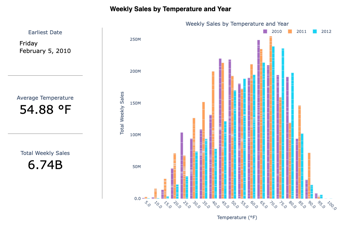](reports/Report_2_Weekly_Sales_by_Temperature_and_Year.png) |
| **Report 3: Weekly Sales by Store Size** | Evaluates how store square footage affects sales. Larger stores show significantly higher weekly sales overall. | [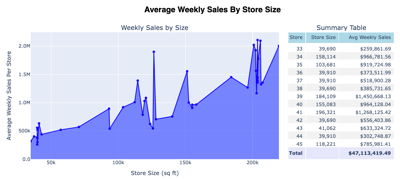](reports/Report_3_Weekly_Sales_by_Store_Size.png) |
| **Report 4: Weekly Sales by Store Type and Month** | Breaks down sales by store type (A, B, C) and month to identify seasonal and structural sales differences. | [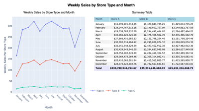](reports/Report_4_Weekly_Sales_by_Store_Type_and_Month.png) |
| **Report 5: Markdown Sales by Year and Store** | Highlights how markdown strategies vary by store and year. Useful for identifying aggressive discounting trends. | [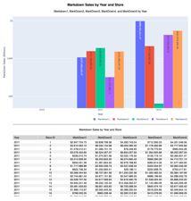](reports/Report_5_Markdown_Sales_by_Year_and_Store.png) |
| **Report 6: Weekly Sales by Store Type** | Shows how each store type performs in total sales. Store Type A consistently outpaces B and C. | [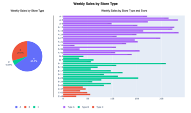](reports/Report_6_Weekly_Sales_by_Store_Type.png) |
| **Report 7: Fuel Price by Year** | Explores the relationship between fuel prices and weekly sales, revealing slight inverse trends in some periods. | [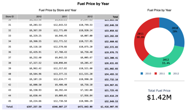](reports/Report_7_Fuel_Price_by_Year.png) |
| **Report 8: Weekly Sales by Year, Month, Day** | Provides time-based breakdowns by year, month, and calendar day. Highlights peak sales times and trends. | [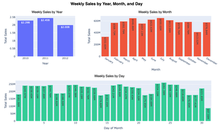](reports/Report_8_Weekly_Sales_By_Year_Month_Day.png) |
| **Report 9: Weekly Sales by CPI** | Displays the impact of Consumer Price Index (CPI) on sales using both raw scatter and aggregated trend views. | [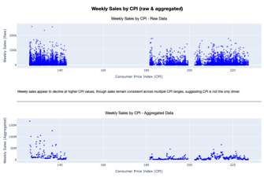](reports/Report_9_Weekly_Sales_by_CPI.png) |
| **Report 10: Weekly Sales by Department** | Visualizes sales across 99 departments, with a breakdown of the top 5 and total contributions. | [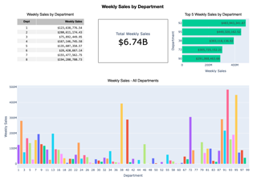](reports/Report_10_Weekly_Sales_by_Department.png) |

## 🔍 Key Insights

- Store Type A consistently outperformed Types B & C across all seasons
- Department 92 generated the highest total sales, but not in the largest stores
- CPI and unemployment fluctuations showed weak correlation to sales
- Holiday weeks generated substantial revenue spikes compared to non-holiday weeks

📊 View sample dashboards and visual reports in `/reports/`. -->

This project was developed using Jupyter Notbooks and Python scripts.
It assumes access to Snowflake and an S3 bucket with CSV data staged.

🛠️ Technologies: Python • Pandas • Plotly • dbt • Snowflake • AWS S3

