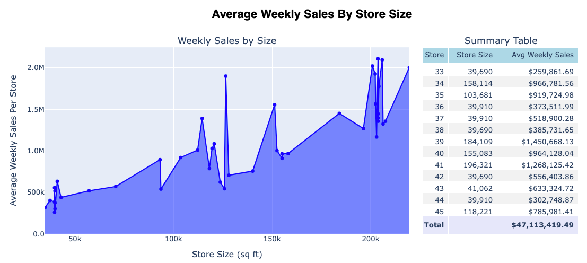
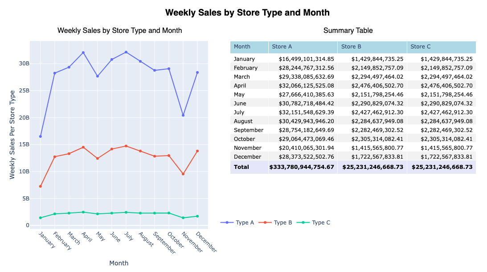

## 📦 Walmart Sales Analytics Pipeline

This project analyzes historical weekly sales data for Walmart, applying modern data engineering practices to build a cloud-native analytics pipeline. The goal is to transform raw CSV data into dimensional models and deliver actionable insights through visual reporting.

This project demonstrates a modern data engineering workflow using:

- **AWS S3** for storage of raw CSV data
- **Snowflake** for cloud warehousing
- **dbt** for transformation into dimensional models (SCD2 fact + store/date dimensions)
- **Python + Plotly** for interactive reporting and visualization

🔍 Key Insights
- Highest performing departments are not always in the largest stores

- Weekly sales fluctuate appreciably with CPI and Unemployment Index

- Store Type A outerforms Types B & C consistently across all months

📊 View sample dashboards and visual reports in `/reports/`.

This project was developed using Jupyter Notbooks and Python scripts.
It assumes access to Snowflake and an S3 bucket with CSV data staged.

🛠️ Technologies: Python • Pandas • Plotly • dbt • Snowflake • AWS S3

